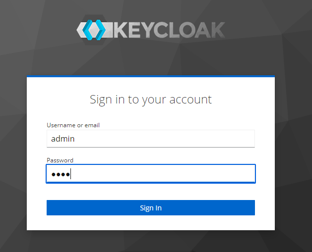
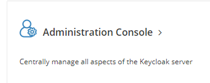
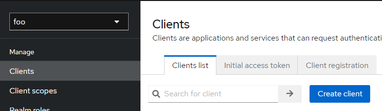
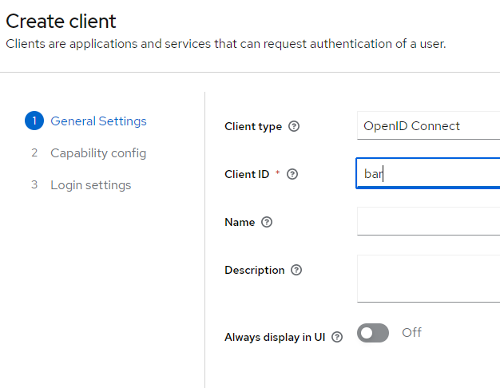
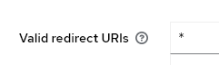

# Keycloak OAuth2 Login 설정
my5g 프로젝트에서는 spring boot로의 전환 및 keycloak 연동에 있었다.  
따라서 기존에 spring framework 기반에 xml을 버리고 새로 진행하였다.  
아래는 그 과정에서 진행했던 것은 예시로 만들어 보았다.

## Keycloak Install
keycloak install은 docker 명령어를 통해 아래와 같이 기동하였다.
```bash
docker run -d --restart=unless-stopped --name keycloak-21.1 -p 9090:8080 KEYCLOAK_ADMIN=admin -v /app/keycloak/data/:/opt/jboss/keycloak/standalone/data/ -e KEYCLOAK_ADMIN_PASSWORD=1234 quay.io/keycloak/keycloak:21.1
```

## Keycloak Setting
1. 로그인을 통해 Admin Console을 접근한다.
1. Admin Console에서 Realm을 생성한다.
1. Realm을 생성한 뒤 ClientID를 생성한다.
1. Client에서 Valid Redirect URL을 설정한다.

로그인 접속    


Admin Console    


Realm 생성  


Client ID 생성  


Client Setting  


## Spring Boot Setting
1. pom.xml을 설정한다.
1. application.yml에 keycloak을 설정한다.
1. Spring Security에 keycloak을 설정한다.

keycloak pom.xml 설정  
docker에서 설치한 keycloak 버전과 라이브러리 버전이 맞는지 확인하고 install을 진행한다.  
```xml
<dependency>
    <groupId>org.keycloak</groupId>
    <artifactId>keycloak-spring-boot-starter</artifactId>
    <version>21.1.1</version>
</dependency>
```


```yaml
keycloak:
  auth-server-url: ${keycloak.url}
  realm: ${keycloak.realm-id}
  resource: ${keyclock.client-id}
  ssl-required: external
  verify-token-audience: true
  use-resource-role-mappings: true
  confidential-port: 0
  principal-attribute: preferred_username
```

### Spring Security 설정
1. AuthenticationSuccessHandler: keycloak 로그인 후 처리할 작업을 구현해놓은 클래스
1. JWT를 받을 default url
1. LogoutHandler: keycloak 로그아웃 후 처리할 작업을 구현해놓은 클래스 

```java
@Configuration
public class SecurityConfiguration {
    private AuthenticationSuccessHandler authenticationSuccessHandler;
    private LogoutHandler logoutHandler;

    @Value("${spring.security.oauth2.resourceserver.jwt.issuer-uri}")
    private String issuerUri;

    public SecurityConfiguration(LoginService loginService) {
        this.authenticationSuccessHandler = new KeycloakAuthenticationSuccessHandler(
            new KeycloakAuthenticationSuccessHandlerImpl(loginService));
        this.logoutHandler = new KeycloakLogoutHandler(loginService);
    }
```

1. authorizeHttpRequests: 정적 자원 및 회원 가입을 인증 처리에서 제외
1. oauth2Login: login 시 자동적으로 keycloak URL로 redirect 및 로그인 성공 후처리
1. logout: logout 후처리, session invalidate, logout url, logout후 url
1. sessionManagement: sessionAuthenticationErrorUrl session이 인증되지 않았을 경우의 url
```java
    @Bean
    SecurityFilterChain filterChain(HttpSecurity http) throws Exception {
        return http
            .authorizeHttpRequests(requests -> {
                requests.antMatchers(
                        "/static/**",
                        "/signup/**"
                        )
                        .permitAll()
                    .anyRequest().authenticated();
            })
            .oauth2Login(login -> {
                login.loginPage(issuerUri)
                    .successHandler(authenticationSuccessHandler);
            })
            .logout(logout -> {
                logout.addLogoutHandler(logoutHandler)
                    .invalidateHttpSession(true)
                    .logoutUrl("/logout")
                    .logoutSuccessUrl("/");
            })
            .oauth2ResourceServer(oauth2 -> {
                oauth2.jwt();
            })
            .sessionManagement(session -> {
                session.sessionAuthenticationStrategy(
                        new RegisterSessionAuthenticationStrategy(new SessionRegistryImpl())
                    )
                    .sessionAuthenticationErrorUrl("/");
            })
            .csrf(csrf -> {
                csrf.disable();
            })
            .build();
    }
```

1. keyclaok OAuth2 등록
```java

    @Bean
    KeycloakOAuth2UserService keycloakOAuth2UserService(OAuth2ClientProperties oauth2ClientProperties) {
        JwtDecoder jwtDecoder = NimbusJwtDecoder.withJwkSetUri(
                oauth2ClientProperties.getProvider().get("keycloak").getJwkSetUri())
            .build();

        SimpleAuthorityMapper authoritiesMapper = new SimpleAuthorityMapper();
        authoritiesMapper.setConvertToUpperCase(true);

        return new KeycloakOAuth2UserService(jwtDecoder, authoritiesMapper);
    }

}
```

### 로그인 성공 후 처리 클래스
1. loginService를 통해 데이터베이스에 user 정보가 있는지 확인 한다.
1. 없으면 신규 회원이므로 signup 페이지로 redirect 한다.
```java
public class KeycloakAuthenticationSuccessHandlerImpl implements AuthenticationSuccessHandler {
    private LoginService loginService;

    public KeycloakAuthenticationSuccessHandlerImpl(LoginService loginService) {
        this.loginService = loginService;
    }

    @Override
    public void onAuthenticationSuccess(
            HttpServletRequest request, HttpServletResponse response, Authentication authentication)
            throws IOException, ServletException {
        HttpSession session = request.getSession(true);
        try {
            session.setAttribute("USER_DETAIL", loginService.findByPrincipal(authentication));
            loginService.saveLogin(authentication);
            response.sendRedirect("/");
        } catch (Exception e) {
            response.sendRedirect("/signup");
        }
    }
}
```